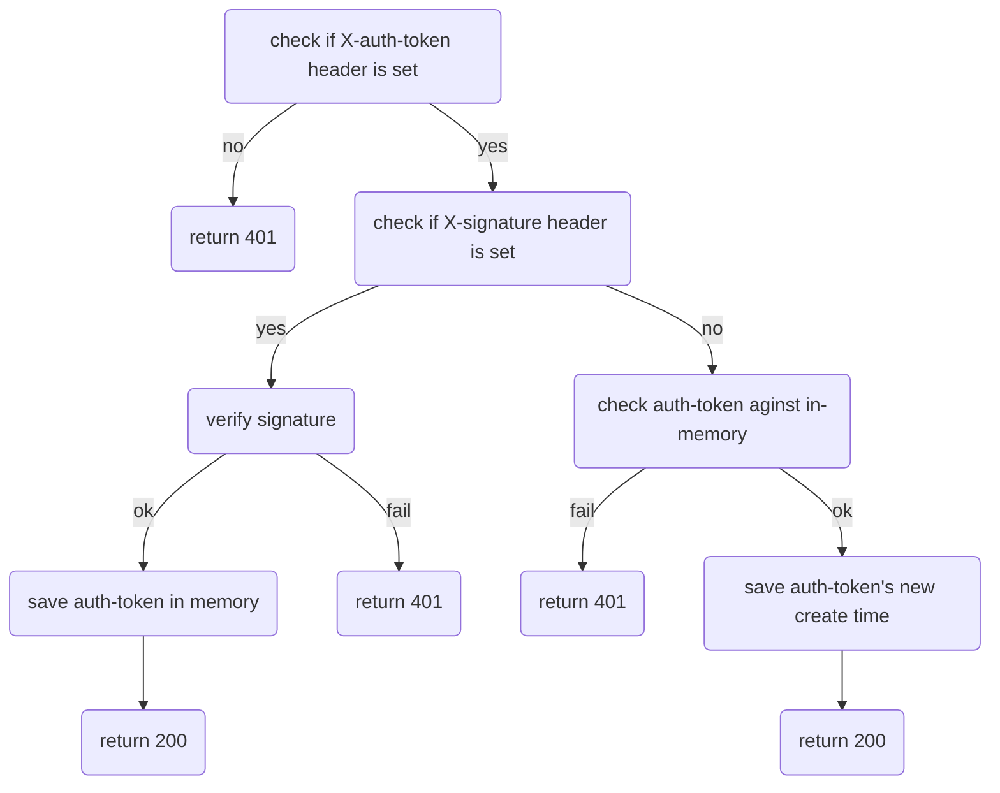

# HoloPort Admin Crypto Server

Server is listening on loopback address `http://127.0.0.1:2884/` for incoming http requests.

Based on value of the following headers
- x-hpos-admin-signature
- x-original-uri
it responds with 200 or 401. Signature is checked against `HP Admin Key`. The value of `HP Admin Key` is read from the file located via environmental variable `HPOS_STATE_PATH`.

## Code logic


## Usage
Compile:
```
nix-shell
cargo build
```

Run:
```
./hp-admin-crypto-server
```

## Logging
`hp-admin-crypto-server` provides robust logging via rust's `env_logger` crate. Run with `RUST_LOG=debug` for detailed logging to `stdout`.